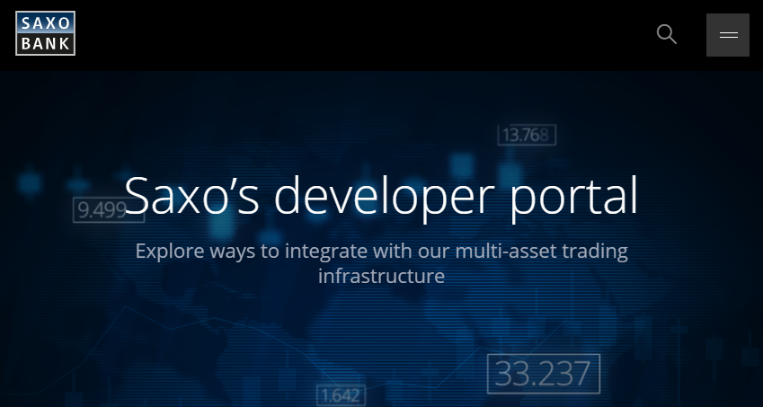
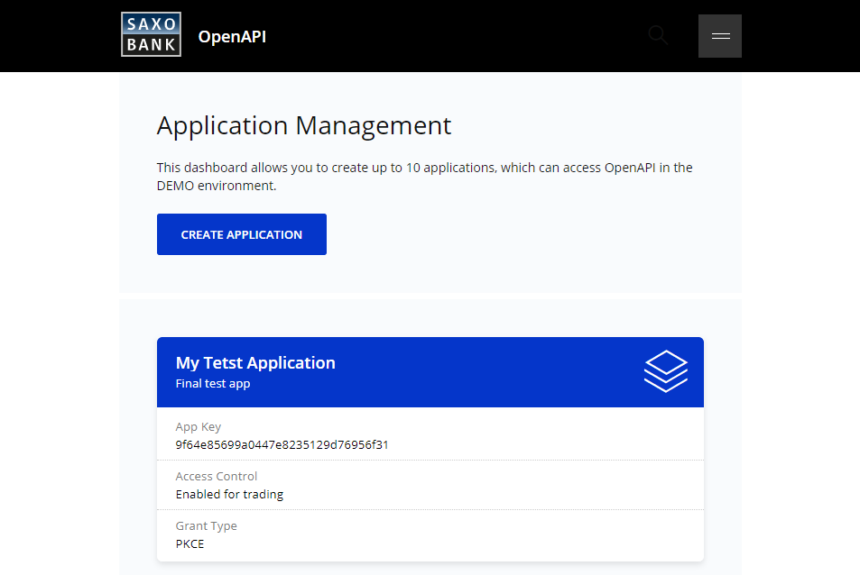

# Useful Tools

??? abstract
    Developing against the OpenAPI is made easy with a selection of tools that provide useful features for anyone looking to get started quickly. Check out:

    - [The Developer Portal](https://developer.saxo)
    - [The Tutorial](https://www.developer.saxo/openapi/tutorial)
    - [The OpenAPI Explorer](https://www.developer.saxo/openapi/explorer)
    - [24-Hour Tokens](https://www.developer.saxo/openapi/token)
    - [Application Management](https://www.developer.saxo/openapi/appmanagement)
    - [Postman](https://www.getpostman.com/)
    - [Fiddler](https://www.telerik.com/fiddler)

---
  
To optimize your development efforts while working with Saxo's OpenAPI, the below tools are recommended for any developer. These tools range from 'get to know the platform'-apps to fully-fledged debugging environments. You are invited to use these tools as you progress through the articles on this website, as they provide an excellent way to try the features of the OpenAPI yourself while you learn about them.

## Tools Provided by Saxo

### [The Developer Portal](https://developer.saxo)

This is the go-to resource if you are starting out on the OpenAPI. [Create a developer account](https://www.developer.saxo/accounts/sim/signup) on the portal to fully leverage the features it provides (see below). This account lives in Saxo's Simulation (or 'Demo') environment and is pre-configured to be used as OpenAPI user. You can log into [SaxoTraderGO](https://www.saxotrader.com/sim/login/) or [SaxoTraderPRO](https://www.home.saxo/platforms/saxotraderpro) with this account to see what a 'standard' Saxo configuration looks like. It is generally recommended to check these platforms out if you haven't seen them already - they are built entirely on top of the OpenAPI infrastructure (observing network traffic from these apps can tell you a lot about appropriate OpenAPI usage).

{: style="height:350px;width:auto"}

### [The Tutorial](https://www.developer.saxo/openapi/tutorial)

!!! info
    The Tutorial and other Developer Portal tools discussed below require an account on the portal before they can be used. See the steps outlines above to create you free account.

The Tutorial is a simple 3-minute click-through guide on the Developer Portal that showcases a couple of basic API request/response examples. It provides an excellent introduction into core aspects of the OpenAPI and is generally recommended as a good 'get to know the API'-tool.

{: style="height:350px;width:auto"}

### [The OpenAPI Explorer](https://www.developer.saxo/openapi/explorer)

Now that you have acquired a basic understanding of the OpenAPI, let's build some requests ourselves! The Explorer is very similar to tools such as Postman (see below) and lets you create your own requests directly on the portal. It is convenient for on-the-fly debugging and trying out certain endpoints to 'get a feel' for how they behave before implementing them into your own application. It supports all available API endpoints and includes streaming: you can set up a websocket connection and watch updates flow in real-time.

{: style="height:350px;width:auto"}

### [24-Hour Tokens](https://www.developer.saxo/openapi/token)

At this point, you probably want to start calling the OpenAPI from within your own application/environment. To make this easy, Saxo provides 24-hour tokens which you can hard-code into the sample you are building (practically skipping the authentication step altogether). Accept the disclaimer on the portal and get started with requests inside your own app right away!

### [Application Management](https://www.developer.saxo/openapi/appmanagement)

You can register an application in Saxo's SIM environment on the above link and obtain your own `AppKey` and `AppSecret`, which can be used to request access and refresh tokens through [Saxo's standard OAuth implementation]. This is considered the final step in your journey towards a 'real-life' app.

{: style="height:350px;width:auto"}

## Third-Party Tools

The below apps can be used for free and are generally considered exceptional Web/API debugging tools. Saxo is not affiliated with any of these platforms.

### [Postman](https://www.getpostman.com/)

An open-source API debugging app that allows the user to conveniently test any (Web) API. Very similar to [the Explorer](#the-openapi-explorer) discussed above, but allows for more extensive in-depth request configuration. Great way to quickly tinker with OpenAPI requests before implementing them into your own application.

### [Fiddler](https://www.telerik.com/fiddler)

A comprehensive web debugging proxy that allows the user to monitor their app's behavior and catch failing API calls in real-time. Especially useful when your app starts to scale out and sends numerous requests to the OpenAPI (asynchronously). Strongly recommended in case you run into (potential) bugs or issues as it records valuable information that the Saxo team needs to provide efficient support (see next section).